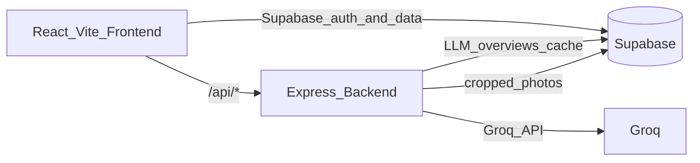

# ProTech — Dashboard for UCD Football

ProTech is a full-stack athlete performance dashboard for UCD Football. It tracks Force Plate and NordBoard metrics, compares athletes over time, generates AI-written player overviews, and supports photo uploads with server-side cropping.

## Features

- Athlete cards with performance data and year-over-year photos
- Force Plate and NordBoard metric tracking, charts, and comparisons
- AI-generated player overviews (Groq LLM, cached in Supabase)
- Server-side athlete photo cropping via pose detection
- Supabase authentication with protected recruitment and alumni routes
- CSV/XLSX upload and parsing for bulk data entry

## Architecture



- **Frontend** — React 19 + Vite in `Frontend/ProTech/`; deployed to Vercel
- **Backend** — Express API in `backend/`; deployed to Render
- **Database & storage** — Supabase (auth, athlete data, image storage, overview cache)
- **Data tooling** — Python and Node scripts in `Data/` and `Frontend/ProTech/` for CSV cleaning and bulk uploads

## Prerequisites

- **Node.js 20+** (required by the backend)
- npm 8+
- A Supabase project
- Groq API key (optional; needed for AI player overviews)
- Python 3 (optional; only for `Data/` cleaning scripts)

## Quick Start (Local Development)

Run the backend and frontend in separate terminals.

### Backend

```bash
cd backend
cp .env.example .env   # fill in Supabase + Groq keys (see below)
npm install
npm run dev            # http://localhost:5000
```

### Frontend

```bash
cd Frontend/ProTech
cp .env.example .env   # VITE_SUPABASE_URL, VITE_SUPABASE_ANON_KEY
npm install
npm run dev            # http://localhost:5173
```

In local development, Vite proxies `/api` requests to `http://localhost:5000` (see `Frontend/ProTech/vite.config.js`), so `VITE_API_URL` can stay empty.

## Environment Variables

See `backend/.env.example` and `Frontend/ProTech/.env.example` for full details.

| Location | Variables | Purpose |
|----------|-----------|---------|
| `Frontend/ProTech/.env` | `VITE_SUPABASE_URL`, `VITE_SUPABASE_ANON_KEY`, `VITE_API_URL` (production only) | Client auth/data; API base URL in production |
| `backend/.env` | `PORT`, `VITE_SUPABASE_URL`, `VITE_SUPABASE_ANON_KEY`, `SUPABASE_SERVICE_ROLE_KEY`, `GROQ_API_KEY`, `LLM_PROVIDER`, `FRONTEND_URL` | API server, storage writes, LLM, CORS |

Notes:

- Do not include a trailing `/` on Supabase URLs.
- Use the **anon key** in the frontend (never the service role key).
- The backend requires `SUPABASE_SERVICE_ROLE_KEY` for athlete photo uploads and overview cache writes.

## Build & Preview (Frontend)

From `Frontend/ProTech/`:

```bash
npm run build    # output in dist/
npm run preview  # preview production build locally
```

## Backend API

| Method | Route | Description |
|--------|-------|-------------|
| GET | `/api/health` | Health check |
| POST | `/api/player-overview` | Generate AI overview from pre-computed analytics (cached in Supabase) |
| POST | `/api/athlete-photo` | Upload and pose-crop athlete photo to the `athlete-images` bucket |
| POST | `/upload` | Parse CSV, XLS, or XLSX and return JSON rows |

## Project Structure

```
ProTech/
├── Frontend/ProTech/     # React + Vite app
│   ├── src/
│   │   ├── components/   # UI components (ForcePlate, NordBoard, AthleteCard, etc.)
│   │   ├── pages/        # Routes (Homepage, Recruitment, Alumni)
│   │   ├── contexts/     # Auth context
│   │   └── utils/        # Supabase client, metrics, name formatting
│   └── upload_*.js       # One-off bulk upload scripts
├── backend/
│   ├── server.js         # Express entry point
│   └── lib/              # LLM, Supabase, photo cropping, env loading
├── Data/
│   ├── raw_csv/          # Source CSV exports
│   ├── cleaned/          # Processed CSVs
│   └── *.py              # Python cleaning scripts
├── DEPLOYMENT_GUIDE.md   # Vercel frontend deployment guide
└── README.md
```

## Supabase Setup

- Storage bucket for athlete images: `athlete-images`
- Images are stored at paths like `/<athleteId>/<year>.jpg`
- Ensure the bucket has public read access, or generate signed URLs for private buckets
- Row Level Security (RLS) should be configured for production data access

## Deployment

- **Frontend:** Deploy to Vercel with root directory `Frontend/ProTech`. See [DEPLOYMENT_GUIDE.md](DEPLOYMENT_GUIDE.md) for step-by-step instructions.
- **Backend:** Deploy to Render. Set `FRONTEND_URL` to your Vercel origin (for CORS) and configure Supabase + Groq env vars.
- **Production frontend env:** Set `VITE_API_URL` to your deployed backend origin (e.g. `https://your-api.onrender.com`).

## Data Scripts

The `Data/` directory contains Python scripts for cleaning raw CSV exports and Node scripts in `Frontend/ProTech/` (e.g. `upload_nordboard_data.js`, `upload_cmj_data.js`) for bulk uploading processed data to Supabase. These are one-off maintenance tools, not part of the runtime app.

## Troubleshooting

### Frontend: `TypeError: Load failed`

- Remove any trailing `/` from `VITE_SUPABASE_URL`.
- Ensure `.env` exists in `Frontend/ProTech/` and restart `npm run dev` after changes.
- Reinstall deps: `rm -rf node_modules package-lock.json && npm install`.

### Backend: photo upload or overview cache fails

- Confirm `SUPABASE_SERVICE_ROLE_KEY` is set in `backend/.env`.
- Check that the `athlete-images` bucket exists in Supabase storage.

### API calls fail in production

- Verify `VITE_API_URL` points to the deployed backend origin.
- Confirm `FRONTEND_URL` on the backend matches your Vercel URL (for CORS).
